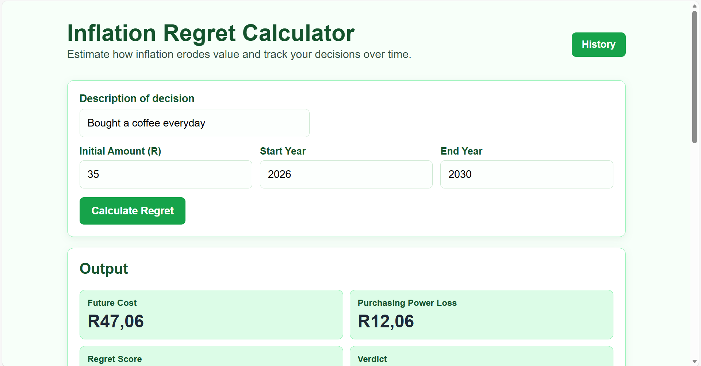
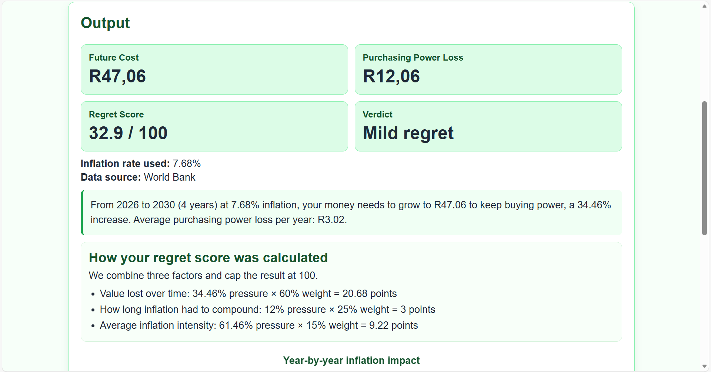
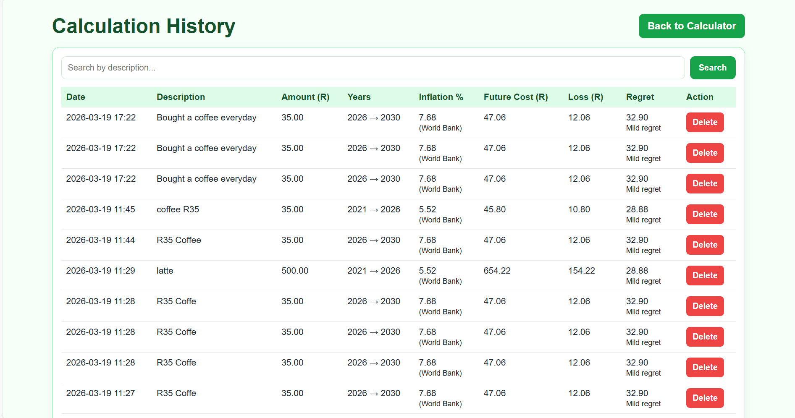

## Inflation Regret Calculator

A financial decision simulator that quantifies the hidden cost of everyday spending using inflation data, API integration, and a custom regret scoring model.

Most financial decisions feel small in the moment — a coffee, a subscription, a quick purchase.

🔗 Live Demo: https://eco5040s-minihackathon.onrender.com/team1/
---

## Key Features

* **Financial Regret Score (0–100)**
  Quantifies the impact of a decision using multiple weighted factors

* **Inflation-adjusted cost modeling**
  Calculates how much money needs to grow to maintain purchasing power

* **Live economic data integration**
  Uses World Bank API for inflation rates

* **Explainable scoring system**
  Breaks down how regret is calculated (not just a black box)

* **Calculation history tracking**
  Stores and retrieves past decisions using SQLite

* **Time-series visualization**
  Displays year-by-year inflation impact

---

## Screenshots

### Input Interface

### Results & Regret Score

### Calculation History

## Example Insight

> Buying a R35 coffee daily may seem small —
> but under inflation, it results in a **34% increase in required future value**,
> leading to measurable purchasing power loss.

---
## My Contribution
This project was developed as part of a team hackathon.

My role included:
- Designing the financial regret scoring model
- Implementing Flask routes and API integration (Python)
- Collaborating via Git (branching, merging, pull requests)
- Working under time constraints to deliver a functional MVP
---
## Tech Stack

* **Backend:** Flask (Python)
* **Frontend:** HTML, CSS, Jinja2
* **Database:** SQLite + SQLAlchemy
* **Data:** World Bank API
* **Tools:** Git, GitHub, Copilot
---
## What This Project Demonstrates

* Ability to connect **finance + data + engineering**
* Building **end-to-end data products**
* Working in **team-based Git environments**
* Turning abstract concepts into **user-facing tools**
---
## 🤝 Acknowledgements
Original team repository: 
